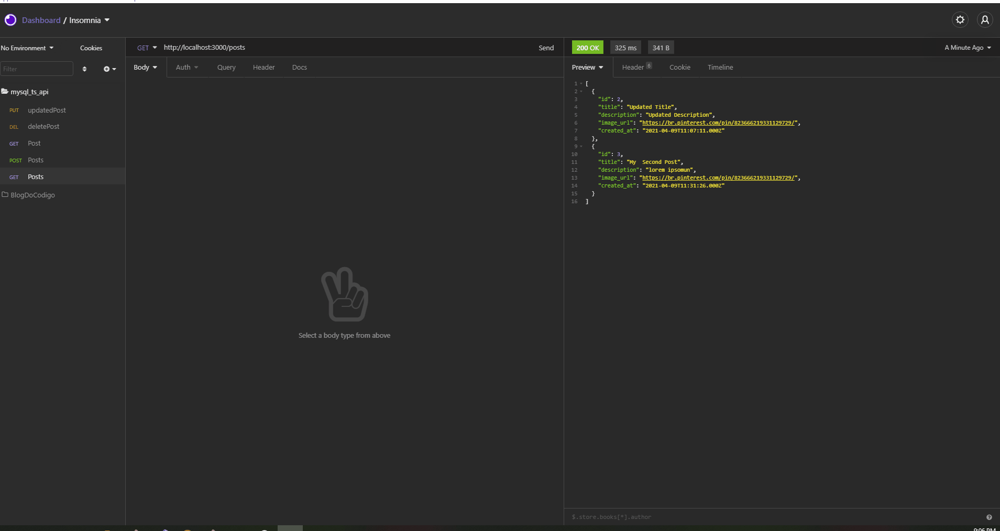

<h1 style="text-align: center;">TypeScript Api</h1>

Este projeto é uma API simples desenvolvida com o intuido de práticar typescript juntamente com mysql!
    Desenvolvido durante tutorial <a href="https://www.youtube.com/watch?v=4clEduk6OQM">Typescript & MySQL REST API (Nodejs & Express)<a> do canal <a href="https://www.youtube.com/channel/UCMn28O1sQGochG94HdlthbA">Fazt Code</a>

Neste projeto nos conectamos com o banco mysql e criamos rotas de put, post, get e delete utilizando express!

Para utilizar clone este repositório, depois rode <code>npm i</code>, que será responsável por baixar todos os pacpotes necessários para o funcionamento do projeto. Vá para o arquivo <a href="./sql/database.sql">database.sql</a> rode o script contido neste arquivo, que será responsável por criar o banco e as tabelas necessárias para este projeto. Vá ao arquivo <a href="./src/database.ts">database.ts</a> e altere as credenciais de seu banco! Depois destes passos seguidos basta rodar <code>npm run dev</code> e a api estará utilizando a porta 3000!
